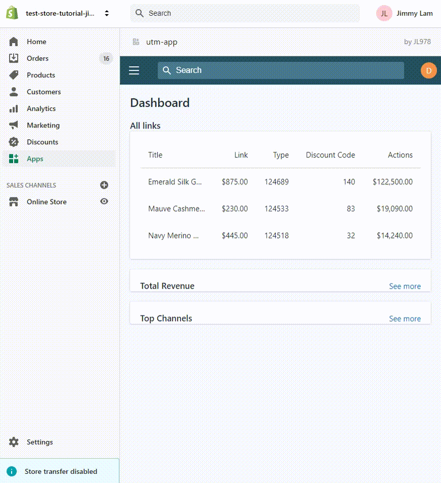

# Shopify UTM generator and shortener

A Shopify embedded app made with Node, [Next.js](https://nextjs.org/), [Shopify-koa-auth](https://github.com/Shopify/quilt/tree/master/packages/koa-shopify-auth), [Polaris](https://github.com/Shopify/polaris-react), and [App Bridge React](https://shopify.dev/tools/app-bridge/react-components).

## Description
This is an embedded app that let the shop owner choose one of their product and generate a utm link to that product similar to this [link builder](https://ga-dev-tools.appspot.com/campaign-url-builder/) by google. The advantage of this is that it is integrated to a store so that the shop own does not have to go look for the specific link for each of the product. The app will also save the links and provide a shortened version for better user experience

*work in progress